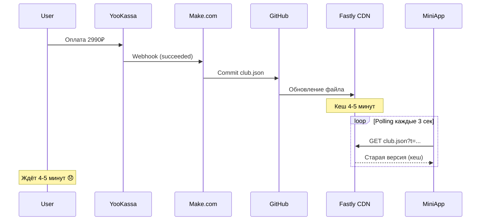
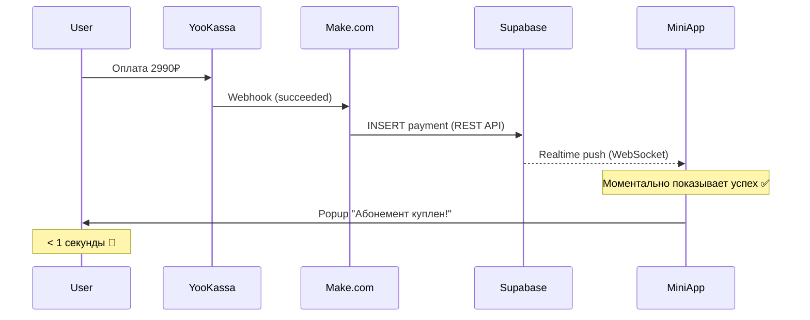

# PRD: Миграция club.json на Supabase с Realtime обновлениями

**Тикет**: T-006
**Автор**: Claude + Andrej Seleznev
**Дата создания**: 2026-02-14
**Статус**: PRD_READY

---

## Краткое описание

Заменяем файловое хранилище club.json (GitHub Pages) на Supabase PostgreSQL с Realtime подписками для мгновенного отображения успешных платежей абонемента клуба без polling и задержек CDN кеширования.

---

## Проблема / Возможность

### Контекст

**Текущая боль пользователя**:
- После оплаты абонемента клуба (2990₽) пользователь ждёт 4-5 минут, пока данные обновятся
- Даже с ускоренным polling (3 сек × 50 попыток = 2.5 мин) платёж не обнаруживается из-за CDN кеша
- Пользователь не уверен: "прошла ли оплата?" → негативный UX, возможны повторные платежи

**Техническая проблема**:
- GitHub Pages использует Fastly CDN с жёстким кешированием 4-5 минут
- Параметр `?t=Date.now()` игнорируется CDN
- У нас нет контроля над заголовками `Cache-Control`
- Polling расходует ресурсы и всё равно не успевает

### Текущая ситуация (AS IS)



**Проблемы**:
1. ⏱️ Время обновления: 4-5 минут (неприемлемо)
2. 🔄 Бесполезный polling: 50 запросов × 3 сек = излишняя нагрузка
3. 📉 Плохой UX: пользователь не знает, прошла ли оплата
4. 🚫 Нет контроля: GitHub Pages не даёт управлять кешем

### Желаемая ситуация (TO BE)



**Преимущества**:
1. ⚡ Время обновления: **< 1 секунда**
2. 🚀 Нет polling: WebSocket push-уведомления
3. ✅ Отличный UX: мгновенная обратная связь
4. 📊 Масштабируемость: легко добавить другие данные (встречи, пользователи)

---

## Требования

### Функциональные требования

#### Must Have

- [x] Создать таблицу `club_payments` в Supabase с полями:
  - `id` (UUID, primary key)
  - `payment_id` (TEXT, unique, от YooKassa)
  - `telegram_user_id` (BIGINT, для фильтрации)
  - `amount` (INTEGER, копейки)
  - `status` (TEXT: pending/succeeded/canceled)
  - `created_at` (TIMESTAMPTZ)
  - `payment_data` (JSONB, полные данные от YooKassa)

- [x] Настроить Row Level Security (RLS):
  - Публичный READ доступ (для фронтенда)
  - Запретить INSERT/UPDATE/DELETE для anon ключа
  - Только service_role может писать (Make.com)

- [x] Интегрировать Make.com:
  - Заменить "GitHub commit" на "Supabase → Insert record"
  - Использовать `service_role` ключ (секретный)
  - Записывать платежи при получении webhook от YooKassa

- [x] Обновить фронтенд:
  - Подключить Supabase JS SDK (CDN)
  - Настроить Realtime подписку на INSERT в `club_payments`
  - При получении платежа → показать success popup + haptic feedback
  - Обновить UI вкладки "Клуб" (отобразить Zoom ссылку)

- [x] Убрать старый код:
  - Удалить `loadClubData()` из app.js
  - Удалить polling функции (`startClubPaymentPolling`, `startBackgroundPolling`)
  - Удалить club.json из репозитория (опционально оставить как backup)

#### Should Have

- [ ] Миграция существующих данных из club.json в Supabase (если есть)
- [ ] Индексы на `telegram_user_id` и `status` для быстрых запросов
- [ ] Логирование ошибок Realtime подписки
- [ ] Graceful fallback: если WebSocket отвалился, переподключиться автоматически
- [ ] Отображение истории платежей (не только последнего)

#### Could Have (Nice to Have)

- [ ] Dashboard в Supabase Studio для мониторинга платежей
- [ ] Email уведомления при новом платеже (через Supabase Edge Functions)
- [ ] Экспорт платежей в CSV для аналитики

### Нефункциональные требования (NFR)

**Производительность**:
- Время от платежа до уведомления: **< 1 секунда** (99 перцентиль)
- WebSocket reconnect при обрыве: **< 3 секунды**
- Размер Supabase SDK (CDN): **~50KB gzipped** (приемлемо)

**Безопасность**:

Детальная секция безопасности: см. раздел "Безопасность и защита данных" ниже

**UX/UI**:
- Haptic Feedback при получении платежа (`notificationOccurred('success')`)
- Success popup с сообщением "✅ Абонемент успешно куплен!"
- Автоматическое обновление UI (Zoom ссылка, статус абонемента)
- Не требуется ручное обновление страницы

**Надёжность**:
- Supabase SLA: 99.9% uptime
- PostgreSQL ACID гарантии (нет дублирования платежей)
- Автоматический reconnect при потере WebSocket соединения

---

## Сценарии использования

### Основной сценарий (Happy Path)

**Действующие лица**: Пользователь, YooKassa, Make.com, Supabase, Mini App

**Предусловия**:
- Пользователь открыл Mini App, вкладка "Клуб"
- У пользователя НЕТ активного абонемента
- Supabase Realtime подписка активна (WebSocket connected)

**Шаги**:

1. Пользователь нажимает "Купить абонемент 2990₽"
2. Система создаёт платёж через Make.com → YooKassa
3. Система показывает модальное окно с подтверждением
4. Пользователь нажимает "Оплатить" → открывается YooKassa в новой вкладке
5. Пользователь успешно оплачивает (банковская карта)
6. YooKassa отправляет webhook "payment.succeeded" → Make.com
7. Make.com вставляет запись в Supabase: `INSERT INTO club_payments (...)`
8. Supabase отправляет Realtime event через WebSocket → Mini App
9. Mini App получает событие `postgres_changes` с новым платежом
10. Система показывает success popup: "✅ Абонемент успешно куплен!"
11. Система вызывает `tg.HapticFeedback.notificationOccurred('success')`
12. Система обновляет UI: показывает Zoom ссылку, кнопку "Отменить абонемент"

**Результат**:
- Пользователь видит подтверждение **< 1 секунды** после оплаты
- UI автоматически обновлён (нет необходимости перезагружать)
- Данные сохранены в Supabase (надёжно, ACID)

### Альтернативные сценарии

#### Сценарий 2: Пользователь закрыл приложение во время оплаты

**Шаги**:
1. Пользователь оплачивает в YooKassa
2. Пользователь закрывает Mini App (вкладку)
3. Платёж успешно проходит → Make.com записывает в Supabase
4. Пользователь открывает Mini App снова
5. Система подключается к Supabase Realtime
6. Система загружает платежи через REST API: `GET /club_payments?telegram_user_id=eq.{userId}&status=eq.succeeded`
7. Система обнаруживает платёж, показывает UI с активным абонементом

**Результат**: Даже если приложение было закрыто, при открытии пользователь видит актуальный статус.

#### Сценарий 3: WebSocket соединение потеряно

**Шаги**:
1. Пользователь в приложении, WebSocket соединение активно
2. Мобильная сеть обрывается (слабый сигнал)
3. WebSocket отключается
4. Пользователь оплачивает (используя мобильный интернет через YooKassa)
5. Платёж проходит → Supabase записывает данные
6. Но Realtime push НЕ доходит (WebSocket оборван)
7. Supabase SDK автоматически переподключается (reconnect)
8. После восстановления соединения система делает REST запрос для синхронизации
9. Система обнаруживает новый платёж, показывает success popup

**Результат**: Graceful degradation — даже при потере WebSocket данные синхронизируются.

### Исключительные ситуации (Edge Cases)

**Ошибка 1**: Make.com не смог записать в Supabase (неверный API ключ)
- **Причина**: Неправильно настроен `service_role` ключ или RLS политика блокирует
- **Обработка**: Make.com логирует ошибку, повторяет запрос (retry 3 раза)
- **Сообщение пользователю**: Если после 3 минут платёж не появился → показать инструкцию "Переключите вкладку 'Клуб' для обновления"
- **Митигация**: Тестирование Make.com сценария перед деплоем

**Ошибка 2**: Пользователь оплатил, но не получил Realtime уведомление (временный баг)
- **Причина**: WebSocket отвалился / браузер заблокировал / сетевая проблема
- **Обработка**: При переключении на вкладку "Клуб" делаем REST запрос для синхронизации
- **Сообщение пользователю**: Нормальный UI с активным абонементом (без popup)
- **Митигация**: Добавить fallback: каждые 60 секунд делать REST запрос (только если ожидается платёж)

**Ошибка 3**: Дублирующие платежи (пользователь кликнул 2 раза подряд)
- **Причина**: Кнопка не заблокировалась, создались 2 платежа
- **Обработка**:
  - Make.com проверяет `payment_id` (unique constraint в Supabase)
  - Если дубль → игнорируется (constraint violation)
  - В UI блокируем кнопку после первого клика (`disabled = true`)
- **Сообщение пользователю**: Один success popup (для первого платежа)
- **Митигация**: Уже реализовано в T-005 (защита от двойных кликов)

**Ошибка 4**: Supabase недоступен (503 Service Unavailable)
- **Причина**: Технические работы / аварія
- **Обработка**:
  - REST запросы падают с ошибкой
  - WebSocket не подключается
  - Показываем fallback: "⚠️ Проблемы с сервером, попробуйте позже"
- **Сообщение пользователю**: "Данные временно недоступны. Ваши платежи сохранены, просто перезагрузите позже."
- **Митигация**: Supabase SLA 99.9%, редкая ситуация

---

## UI/UX Дизайн

### Основные элементы интерфейса

**Экран 1: Вкладка "Клуб" (до оплаты)**
- Заголовок "Закрытый клуб"
- Описание абонемента (еженедельные встречи, Zoom)
- Цена: "2990 ₽/месяц"
- Кнопка "Купить абонемент" (gradient beige → amber)

**Экран 2: Вкладка "Клуб" (после оплаты)**
- Статус: "✅ Абонемент активен"
- Zoom ссылка (кликабельная, открывается в браузере)
- Дата следующей встречи
- Кнопка "Отменить абонемент" (destructive color)

**Компонент 1: Success Popup**
- Иконка: ✅ (зелёная галочка)
- Заголовок: "Готово"
- Сообщение: "✅ Абонемент успешно куплен!"
- Кнопка "ОК" (закрывает popup)
- Haptic feedback: `notificationOccurred('success')`

### Взаимодействия

- **Клик на "Купить абонемент"**:
  - Haptic: `selectionChanged()`
  - Создаётся платёж → показывается модалка подтверждения

- **Realtime событие получено**:
  - Haptic: `notificationOccurred('success')`
  - Показывается success popup
  - UI обновляется (Zoom ссылка появляется)

- **Клик на Zoom ссылку**:
  - Открывается в браузере (Telegram.WebApp.openLink)
  - Haptic: `impactOccurred('light')`

- **Ошибка загрузки данных**:
  - Haptic: `notificationOccurred('error')`
  - Показывается error message

---

## Зависимости

### Внешние системы

- **Supabase**:
  - PostgreSQL база данных (таблица `club_payments`)
  - Realtime WebSocket API (подписка на изменения)
  - REST API (чтение данных при запуске)
  - Supabase JS SDK v2 (CDN: `https://cdn.jsdelivr.net/npm/@supabase/supabase-js@2`)

- **Make.com**:
  - Маршрут: YooKassa webhook → Supabase Insert
  - Модуль: "Supabase → Insert a record"
  - Credentials: `service_role` ключ (секретный!)

- **YooKassa**:
  - Webhook при успешной оплате (`payment.succeeded`)
  - Никаких изменений не требуется

### Внутренние зависимости

**Файлы**:
- `config.js` — добавить константы `SUPABASE_URL`, `SUPABASE_ANON_KEY`
- `app.js` — заменить `loadClubData()` на Supabase клиент + Realtime подписку
- `index.html` — подключить Supabase SDK (CDN)
- `club.json` — удалить или оставить как резервную копию

**Компоненты**:
- `showSuccessPopup()` — используется при получении Realtime события
- `renderClubView()` — обновляется для отображения данных из Supabase
- `tg.HapticFeedback` — для тактильного отклика

**Удаляемый код**:
- `loadClubData()` — заменяется на Supabase запрос
- `startClubPaymentPolling()` — больше не нужен (Realtime)
- `startBackgroundPolling()` — больше не нужен (Realtime)
- `CacheManager` для `club_data` — Supabase не кешируется на клиенте

---

## Метрики успеха

### Как измерим успех фичи?

**Количественные метрики**:

1. **Время обновления**: от webhook YooKassa до popup на клиенте
   - **Цель**: < 1 секунда (99 перцентиль)
   - **Измерение**: timestamp в `payment_data.created_at` vs timestamp получения Realtime event

2. **Надёжность Realtime**:
   - **Цель**: 99% событий доставляются через WebSocket
   - **Измерение**: сравнение кол-ва платежей в Supabase vs кол-во полученных Realtime events
   - **Fallback**: REST запрос синхронизирует остальные 1%

3. **Размер бандла**:
   - **До**: app.js + polling код ≈ 120KB
   - **После**: app.js + Supabase SDK ≈ 150KB (приемлемо)
   - **Цель**: < 200KB gzipped

4. **Уменьшение polling запросов**:
   - **До**: 50 запросов × каждый платёж = 50 × N запросов в месяц
   - **После**: 0 polling запросов (только Realtime + 1 REST при запуске)
   - **Цель**: 98% снижение количества запросов

**Качественные метрики**:

1. **UX улучшение**: пользователь видит результат мгновенно → меньше сомнений "прошла ли оплата?"
2. **Техдолг**: убираем сложный polling код → проще поддерживать
3. **Масштабируемость**: легко добавить другие таблицы (встречи, пользователи)

---

## 🔒 Безопасность и защита данных

### 1. Row Level Security (RLS) — Основа защиты

**Концепция**: Supabase RLS — это PostgreSQL фича, которая фильтрует строки на уровне базы данных. Даже если кто-то получит доступ к `anon` ключу, они не смогут читать/писать чужие данные.

**SQL политики для `club_payments`**:

```sql
-- Включаем RLS (обязательно!)
ALTER TABLE club_payments ENABLE ROW LEVEL SECURITY;

-- Политика 1: Публичное чтение ВСЕХ succeeded платежей (для фронтенда)
CREATE POLICY "Allow public read succeeded payments"
ON club_payments
FOR SELECT
USING (status = 'succeeded');

-- Политика 2: Запретить INSERT для anon ключа (только service_role)
CREATE POLICY "Deny public insert"
ON club_payments
FOR INSERT
WITH CHECK (false);

-- Политика 3: Запретить UPDATE для anon ключа
CREATE POLICY "Deny public update"
ON club_payments
FOR UPDATE
USING (false);

-- Политика 4: Запретить DELETE для anon ключа
CREATE POLICY "Deny public delete"
ON club_payments
FOR DELETE
USING (false);
```

**Важно**:
- ❌ НЕ фильтруем по `telegram_user_id` в RLS (иначе Realtime не сработает для других пользователей)
- ✅ Фильтрацию делаем на клиенте: `?telegram_user_id=eq.{userId}`
- ✅ Показываем только `succeeded` платежи (pending/canceled скрыты)

---

### 2. API Ключи — Разделение доступа

**Два уровня доступа**:

| Ключ | Где используется | Права | Публичный? | Где хранить |
|------|------------------|-------|------------|-------------|
| `anon` | Фронтенд (app.js) | SELECT succeeded платежей | ✅ ДА | `config.js` (открыто) |
| `service_role` | Make.com | Полный доступ (INSERT/UPDATE/DELETE) | ❌ НЕТ | Make.com environment (секретно!) |

**Защита `service_role` ключа**:

```javascript
// ❌ НИКОГДА НЕ ДЕЛАЙ ТАК:
const SUPABASE_SERVICE_KEY = 'eyJhbGc...'; // В коде фронтенда!!!

// ✅ ПРАВИЛЬНО:
// config.js — ТОЛЬКО anon ключ
SUPABASE_ANON_KEY: 'eyJhbGc...anon...',

// Make.com — service_role в секретных переменных
// Настройки → Environment Variables → SUPABASE_SERVICE_KEY
```

**Ротация ключей** (при компрометации):
1. Зайти в Supabase Dashboard → Settings → API
2. Нажать "Generate new anon key" или "Regenerate service_role"
3. Обновить в `config.js` (anon) и Make.com (service_role)
4. Старые ключи автоматически инвалидируются

---

### 3. SQL Injection — Защита

**Supabase защищает автоматически**: все запросы через REST API параметризованы.

```javascript
// ✅ БЕЗОПАСНО (параметризованный запрос)
const { data } = await supabase
  .from('club_payments')
  .select('*')
  .eq('telegram_user_id', userId); // userId передаётся как параметр

// ❌ ОПАСНО (если бы мы делали raw SQL в коде)
const query = `SELECT * FROM club_payments WHERE telegram_user_id = ${userId}`;
// НЕ ДЕЛАЙ ТАК! (но Supabase SDK не позволит)
```

**Make.com**: используйте модуль "Supabase → Insert record", который автоматически параметризует данные.

---

### 4. HTTPS / TLS — Шифрование транспорта

**Все запросы ТОЛЬКО через HTTPS**:

```javascript
// ✅ ПРАВИЛЬНО
SUPABASE_URL: 'https://your-project.supabase.co' // HTTPS!

// ❌ НЕПРАВИЛЬНО
SUPABASE_URL: 'http://your-project.supabase.co' // HTTP — небезопасно!
```

**Что защищено**:
- REST API запросы (GET /club_payments) → TLS 1.3
- Realtime WebSocket → WSS (WebSocket Secure)
- Supabase Dashboard → HTTPS

**Сертификаты**: Supabase использует Let's Encrypt (автоматическое обновление).

---

### 5. Rate Limiting — Защита от DDoS

**Supabase автоматический Rate Limiting**:

| Действие | Лимит (Free Tier) | Что происходит при превышении |
|----------|-------------------|-------------------------------|
| REST API запросы | 500 req/sec | HTTP 429 (Too Many Requests) |
| Realtime подключения | 200 одновременных | Новые подключения отклоняются |
| Auth операции | 30 req/hour на IP | HTTP 429 |

**Дополнительная защита на фронтенде**:

```javascript
// Debounce для предотвращения спама запросов
let lastFetchTime = 0;
const FETCH_COOLDOWN = 1000; // 1 секунда

async function loadPayments() {
  const now = Date.now();
  if (now - lastFetchTime < FETCH_COOLDOWN) {
    console.warn('⏱️ Слишком частые запросы, пропускаем');
    return;
  }

  lastFetchTime = now;
  // ... делаем запрос
}
```

---

### 6. Аудит и логирование

**Что логируем**:

1. **Make.com**:
   - Все webhook запросы от YooKassa (timestamp, payment_id, amount)
   - Успешные/неудачные INSERT в Supabase
   - Ошибки (неверный API ключ, constraint violations)

2. **Supabase**:
   - Включить "Database Webhooks" для аудита INSERT/UPDATE/DELETE
   - Логи доступны в Dashboard → Database → Logs
   - SQL запросы с медленным выполнением (> 1 sec)

3. **Фронтенд** (app.js):
   ```javascript
   // Логируем критичные операции
   console.log('🔒 [Security] Supabase connected', {
     url: CONFIG.SUPABASE_URL,
     keyType: 'anon' // НЕ логируем сам ключ!
   });

   // Логируем Realtime события
   supabase.channel('audit').on('postgres_changes',
     { event: 'INSERT', schema: 'public', table: 'club_payments' },
     (payload) => {
       console.log('🔒 [Audit] New payment received', {
         payment_id: payload.new.payment_id,
         user_id: payload.new.telegram_user_id,
         timestamp: new Date().toISOString()
       });
     }
   );
   ```

**Retention (сколько хранить логи)**:
- Supabase Free Tier: 7 дней
- Production (рекомендуется): 30+ дней (экспорт в S3 или CloudWatch)

---

### 7. Валидация входных данных

**На стороне Make.com** (перед INSERT):

```javascript
// Псевдокод для Make.com модуля "Filter"
if (!payment.id || payment.id.length < 10) {
  throw new Error('Invalid payment_id');
}

if (!payment.telegram_user_id || payment.telegram_user_id < 1) {
  throw new Error('Invalid telegram_user_id');
}

if (payment.amount !== 299000) { // 2990₽ в копейках
  throw new Error('Invalid amount (must be 299000)');
}

if (!['pending', 'succeeded', 'canceled'].includes(payment.status)) {
  throw new Error('Invalid status');
}
```

**На стороне PostgreSQL** (constraints):

```sql
-- Проверка уникальности payment_id (защита от дублей)
ALTER TABLE club_payments
ADD CONSTRAINT unique_payment_id UNIQUE (payment_id);

-- Проверка что amount положительный
ALTER TABLE club_payments
ADD CONSTRAINT positive_amount CHECK (amount > 0);

-- Проверка корректных статусов
ALTER TABLE club_payments
ADD CONSTRAINT valid_status CHECK (status IN ('pending', 'succeeded', 'canceled'));
```

---

### 8. Защита от утечки данных

**Что скрываем**:

1. **Персональные данные других пользователей**:
   - RLS политика позволяет видеть ВСЕ succeeded платежи, НО
   - На клиенте фильтруем: `.eq('telegram_user_id', userId)`
   - Другие пользователи технически могут увидеть чужие платежи через DevTools

   **Решение** (опционально, для повышенной безопасности):
   ```sql
   -- Альтернативная RLS: показывать только свои платежи
   -- НО: Realtime не будет работать (нужен auth.uid())
   CREATE POLICY "Users see only own payments"
   ON club_payments
   FOR SELECT
   USING (telegram_user_id = current_setting('app.telegram_user_id')::bigint);
   ```

2. **Секретные ключи**:
   - ❌ НЕ логируем API ключи в консоль
   - ❌ НЕ коммитим `.env` файлы с ключами
   - ✅ Используем переменные окружения в Make.com

3. **Payment metadata**:
   - Поле `payment_data` (JSONB) может содержать email, имя пользователя от YooKassa
   - **Не показываем** на фронтенде (только для аналитики в Supabase Dashboard)

---

### 9. CORS и Origin Validation

**Supabase автоматически настроен**:
- CORS разрешён для всех доменов (публичный API с anon ключом)
- Защита через RLS, а не через CORS

**Дополнительная защита** (опционально):
- В Supabase Dashboard → Authentication → URL Configuration
- Добавить "Site URL": `https://andseleznev-lab.github.io/-TGBOT`
- Добавить "Redirect URLs": только доверенные домены

---

### 10. Мониторинг безопасности

**Регулярные проверки** (каждую неделю):

1. **Supabase Dashboard → Database → Logs**:
   - Проверить необычные INSERT/UPDATE/DELETE (не от Make.com)
   - Проверить failed auth attempts

2. **Make.com → Scenario History**:
   - Проверить ошибки webhook (возможные атаки)
   - Проверить количество запросов (DDoS?)

3. **Тестирование RLS**:
   ```javascript
   // Попытка записи с anon ключом (должна провалиться)
   const { error } = await supabase
     .from('club_payments')
     .insert({ telegram_user_id: 123, amount: 1 });

   console.assert(error, 'RLS должен блокировать INSERT!');
   ```

**Алерты** (настроить в Supabase):
- Email при 10+ failed queries за минуту
- Email при превышении 80% storage quota
- Email при downtime > 5 минут

---

### 11. Compliance и Privacy

**GDPR / Персональные данные**:
- `telegram_user_id` — псевдоним (не ФИО), но всё равно персональные данные
- Право на удаление: пользователь может запросить удаление своих платежей
- Срок хранения: 3 года (для налоговой отчётности РФ)

**SQL для удаления данных пользователя**:
```sql
-- Soft delete (помечаем как deleted, но не удаляем физически)
UPDATE club_payments
SET status = 'deleted',
    payment_data = NULL -- очищаем персональные данные
WHERE telegram_user_id = 156702946;

-- Hard delete (полное удаление, только по запросу)
DELETE FROM club_payments
WHERE telegram_user_id = 156702946;
```

---

### 12. Чек-лист безопасности перед деплоем

- [ ] RLS политики включены (`ENABLE ROW LEVEL SECURITY`)
- [ ] `anon` ключ используется ТОЛЬКО на фронтенде
- [ ] `service_role` ключ НЕ закоммичен в Git
- [ ] HTTPS для всех endpoints (не HTTP)
- [ ] SQL constraints добавлены (unique, check)
- [ ] Валидация данных в Make.com настроена
- [ ] Логирование включено (Make.com + Supabase)
- [ ] Протестированы RLS политики (попытка INSERT с anon ключом)
- [ ] Rate limiting проверен (спам запросов)
- [ ] Мониторинг настроен (email alerts)
- [ ] CORS/Origin настроен (если нужно)
- [ ] GDPR compliance: процесс удаления данных описан

---

## Риски и ограничения

### Технические риски

**Риск 1**: Supabase Free Tier лимиты (500MB DB, 2GB egress/месяц)
- **Вероятность**: Низкая (на старте проекта)
- **Влияние**: Среднее (нужно будет переходить на платный план)
- **Митигация**:
  - Мониторить использование в Supabase Dashboard
  - Таблица `club_payments` очень легковесная (< 1KB на платёж)
  - При 1000 платежей в месяц = 1MB (далеко от лимита)

**Риск 2**: Realtime WebSocket не поддерживается в некоторых браузерах/сетях
- **Вероятность**: Низкая (WebSocket поддерживается везде с 2012 года)
- **Влияние**: Среднее (пользователи не получат мгновенное обновление)
- **Митигация**:
  - Graceful fallback: REST запрос каждые 60 сек (если ожидается платёж)
  - При переключении на вкладку "Клуб" всегда делаем REST запрос

**Риск 3**: Make.com не может записать в Supabase (неправильные credentials)
- **Вероятность**: Средняя (ошибка настройки)
- **Влияние**: Критическое (платежи не сохраняются!)
- **Митигация**:
  - Тестировать Make.com сценарий перед деплоем (тестовый платёж)
  - Логировать ошибки в Make.com
  - Резервная копия: club.json (временно оставить как fallback)

**Риск 4**: Row Level Security (RLS) неправильно настроена → утечка данных
- **Вероятность**: Низкая (тестируем перед деплоем)
- **Влияние**: Критическое (другие пользователи могут видеть чужие платежи)
- **Митигация**:
  - Протестировать RLS политики (попытаться прочитать чужие данные с `anon` ключом)
  - Code review SQL миграций

### Ограничения

- **Supabase Free Tier**: 500MB база данных, 2GB egress в месяц
  - При росте нужно переходить на Pro ($25/месяц)

- **Make.com лимит**: 1000 операций в месяц (Free tier)
  - При 1000+ платежей нужно переходить на платный план

- **Telegram Mini Apps**: не поддерживают Service Workers (нельзя получать push уведомления в фоне)
  - Realtime работает только когда приложение открыто

- **Нет истории изменений**: Supabase Realtime не отправляет прошлые события (только новые INSERT)
  - Поэтому при открытии приложения делаем REST запрос

---

## Открытые вопросы

- [x] **Вопрос 1**: Использовать REST API или Supabase SDK?
  - **Решено**: Supabase SDK (проще интеграция Realtime, меньше кода)

- [x] **Вопрос 2**: Удалять ли club.json из репозитория?
  - **Решено**: Оставить как резервную копию (пустой файл), но не использовать в коде

- [x] **Вопрос 3**: Нужна ли миграция существующих данных?
  - **Решено**: Да, если в club.json есть платежи → разовый скрипт миграции

- [ ] **Вопрос 4**: Показывать ли историю всех платежей или только текущий абонемент?
  - **TODO**: Уточнить у пользователя

## Решения и уточнения

### Решение по вопросу 1 (SDK vs REST)
**2026-02-14**: Используем Supabase JS SDK v2
- Плюсы: Realtime из коробки, автоматический reconnect, меньше кода
- Минусы: +50KB к бандлу (приемлемо)

### Решение по вопросу 2 (club.json)
**2026-02-14**: Оставляем club.json как резервную копию (пустой)
- Не удаляем файл (может пригодиться для аварийного отката)
- Но код больше не читает из него

### Решение по вопросу 3 (миграция данных)
**2026-02-14**: Создаём разовый скрипт миграции
- Читаем club.json
- Вставляем все платежи в Supabase через REST API
- Запускаем один раз вручную

---

## История изменений

**2026-02-14 v1.0**:
- Первая версия PRD
- Выбран подход: Supabase SDK + Realtime
- Определены Must Have требования
- Описаны сценарии использования и риски

---

## Чек-лист готовности PRD

Перед переходом к этапу планирования убедись:

- [x] Понятна проблема и цель фичи
- [x] Описаны все must-have требования
- [x] Расписан happy path и основные edge cases
- [x] Определены метрики успеха
- [x] Выявлены риски и зависимости
- [x] Все блокирующие вопросы закрыты
- [x] Статус изменён на `PRD_READY`

**✅ PRD готов к планированию!**
